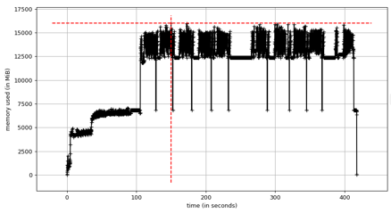

.. Copyright (C) 2026, Advanced Micro Devices, Inc. All rights reserved.

Latency and Memory profiling for Quark ONNX
===========================================

Introduction
------------

AMD Quark ONNX and PyTorch provides comprehensive latency and memory usage profiling through multiple complementary tools:

1. **Built-in GlobalProfiler**: Tracks CPU/GPU memory, disk I/O, and timing at major quantization stages (Pre-process, Calibration, Quantization, Post-process). Outputs to ``quark_profile.yaml``.

2. **External Tools**: Third-party tools like ``mprof`` (memory_profiler) for additional memory analysis.

This tutorial covers all three approaches, with emphasis on the built-in GlobalProfiler for most use cases.

For general profiler documentation including PyTorch examples and custom metrics, see :doc:`../builtin_profiling`.

Built-in Profiler (Memory and Timing)
--------------------------------------

Quark includes a built-in GlobalProfiler that provides comprehensive memory, disk I/O, and timing metrics during ONNX quantization. This profiler tracks CPU memory, GPU memory (CUDA and ROCm), disk read/write activity, and execution timing for each quantization stage.

**Automatic Profiling (Zero-Code Setup):**

Quark automatically profiles all major quantization stages internally. Simply enable profiling with an environment variable:

.. code-block:: python

    import os
    os.environ["QUARK_PROFILING"] = "1"
    os.environ["CUDA_VISIBLE_DEVICES"] = "0"

    from quark.onnx import quantize_static

    # Profiler auto-starts when QUARK_PROFILING=1
    # Results stream to quark_profile.yaml in real-time

    quantize_static(
        model_input="float_model.onnx",
        model_output="quantized_model.onnx",
        calibration_data_reader=calibration_data_reader,
    )

    # Quark automatically profiles these steps internally:
    # - Pre-process Start/End
    # - Calibration Start/End
    # - Quantization (Static) Start/End
    # - Post-process Start/End
    # No user code changes needed!

  Note: User must set CUDA_VISIBLE_DEVICES environment variable for GPU profiling.

**Adding User-Defined Checkpoints (Optional):**

You can also add application-level profiling for operations outside Quark's quantization:

.. code-block:: python

    import os
    os.environ["QUARK_PROFILING"] = "1"

    from quark.common.profiler import GlobalProfiler, ProfileStep
    from quark.onnx import quantize_static

    profiler = GlobalProfiler(output_path="onnx_profile.yaml")

    # User-defined: Profile custom data preparation
    with profiler.scope(ProfileStep.USER_DEFINED, user_msg="Custom Data Loading"):
        calibration_data = load_and_preprocess_data()
        calibration_data_reader = DataReader(calibration_data)

    # Quark auto-profiles internal steps (no manual profiling needed)
    quantize_static(
        model_input="float_model.onnx",
        model_output="quantized_model.onnx",
        calibration_data_reader=calibration_data_reader,
    )

    # User-defined: Profile model validation
    with profiler.scope(ProfileStep.USER_DEFINED, user_msg="Model Validation"):
        validate_quantized_model("quantized_model.onnx")

**Sample Output (quark_profile.yaml):**

.. code-block:: yaml

    memory_usage:
    - step: "Start"
      timestamp: 1709395200.0
      relative_time_secs: 0.0
      cpu_memory_mb: 128.5
      gpu_memory_mb: 0.0
      disk_read_mb: 0.0
      disk_write_mb: 0.0
    - step: "Pre-process Start"
      timestamp: 1709395201.2
      relative_time_secs: 1.2
      cpu_memory_mb: 256.0
      gpu_memory_mb: 0.0
      disk_read_mb: 45.2
      disk_write_mb: 0.5
    - step: "Pre-process End"
      timestamp: 1709395203.5
      relative_time_secs: 3.5
      cpu_memory_mb: 512.5
      gpu_memory_mb: 0.0
      disk_read_mb: 320.8
      disk_write_mb: 1.1
    - step: "Calibration Start"
      timestamp: 1709395204.0
      relative_time_secs: 4.0
      cpu_memory_mb: 515.0
      gpu_memory_mb: 1024.0
      disk_read_mb: 325.0
      disk_write_mb: 1.3
    - step: "Calibration End"
      timestamp: 1709395220.5
      relative_time_secs: 20.5
      cpu_memory_mb: 520.0
      gpu_memory_mb: 2048.5
      disk_read_mb: 890.4
      disk_write_mb: 2.7
    - step: "Quantization (Static) Start"
      timestamp: 1709395221.0
      relative_time_secs: 21.0
      cpu_memory_mb: 768.0
      gpu_memory_mb: 2050.0
      disk_read_mb: 892.1
      disk_write_mb: 3.0
    - step: "Quantization (Static) End"
      timestamp: 1709395235.0
      relative_time_secs: 35.0
      cpu_memory_mb: 640.0
      gpu_memory_mb: 1536.0
      disk_read_mb: 905.3
      disk_write_mb: 158.6
    - step: "End"
      timestamp: 1709395235.5
      relative_time_secs: 35.5
      cpu_memory_mb: 635.0
      gpu_memory_mb: 1530.0
      disk_read_mb: 906.0
      disk_write_mb: 159.2

    # Summary Metrics
    total_quantization_time_seconds: 35.5
    peak_memory_mb: 768.0
    gpu_peak_memory_mb: 2050.0
    total_disk_read_mb: 906.0
    total_disk_write_mb: 159.2

    # Metric Definitions:
    #
    # Checkpoint Metrics (per record):
    # - step: Name of the profiling checkpoint
    # - timestamp: Unix timestamp (seconds since epoch)
    # - relative_time_secs: Time elapsed since profiling started
    # - cpu_memory_mb: Current RSS memory in megabytes
    # - gpu_memory_mb: Current GPU memory usage in megabytes
    # - disk_read_mb: Cumulative disk bytes read (MB) since the start of profiling
    # - disk_write_mb: Cumulative disk bytes written (MB) since the start of profiling
    #
    # Summary Metrics (overall):
    # - total_quantization_time_seconds: Total elapsed time from start to end
    # - peak_memory_mb: Peak CPU memory (RSS) during profiling session
    # - peak_gpu_memory_mb: Peak GPU memory during profiling session
    # - total_disk_read_mb: Total disk bytes read (MB) during the entire profiling session
    # - total_disk_write_mb: Total disk bytes written (MB) during the entire profiling session

**Available ONNX ProfileStep Constants:**

The following ProfileStep constants are automatically used by ONNX quantization functions:

* ``ProfileStep.PRE_PROCESS`` - Pre-processing operations
* ``ProfileStep.CALIBRATION`` - Calibration stage
* ``ProfileStep.QUANTIZATION_STATIC`` - Static quantization
* ``ProfileStep.QUANTIZATION_DYNAMIC`` - Dynamic quantization
* ``ProfileStep.QUANTIZATION_MATMUL_NBITS`` - MatMulNBits quantization
* ``ProfileStep.POST_PROCESS`` - Post-processing operations
* ``ProfileStep.FAST_FINETUNE`` - Fast fine-tuning
* ``ProfileStep.MODEL_CACHING`` - Model caching operations
* ``ProfileStep.FLOAT_MODEL_VALIDATION`` - Float model validation

For complete documentation on the built-in profiler, including custom metrics, GPU profiling requirements, and advanced usage, see :doc:`../builtin_profiling`.

External Memory Profiling Tools
--------------------------------

**Note:** This section describes external memory profiling tools like ``mprof`` (memory_profiler).
For built-in memory profiling that's integrated into Quark, see the "Built-in Profiler" section above.

Efficient memory usage is critical when performing model quantization, especially in environments with limited CPU or GPU resources. This section introduces third-party tools for additional memory profiling beyond Quark's built-in profiler.

1. **Install necessary packages**

To capture memory usage with external tools, you can install the memory_profiler package:

::

    pip install memory_profiler
    pip install matplotlib

2. **CPU memory profiling**

Profiling CPU memory usage is straightforward. By wrapping the Python script with mprof, we can record detailed memory traces during execution.

Example:

::

    mprof run --include-children xxx.py --output mprof_out.dat
    mprof plot mprof_out.dat

This generates a memory usage plot similar to the one shown below (example figure not included here). The graph helps identify peak memory usage and potential bottlenecks in the quantization pipeline.

3. **GPU memory profiling**

GPU memory profiling is now integrated into Quark's GlobalProfiler with support for both NVIDIA CUDA and AMD ROCm platforms. The profiler uses:
- ``nvidia-smi`` for NVIDIA GPUs
- ``rocm-smi`` for AMD ROCm GPUs

See the "Built-in Profiler" section above for usage examples.

**Quick Reference:**

.. code-block:: bash

    export CUDA_VISIBLE_DEVICES=0
    export QUARK_PROFILING=1
    python your_onnx_quantization_script.py

The profiler automatically tracks GPU memory usage and writes results to ``quark_profile.yaml``.

For complete GPU profiling documentation including platform requirements and configuration, see :doc:`../builtin_profiling`.

**Legacy External Tool Approach:**

For users who prefer external tools, ``mprof`` can still track overall process memory consumption, though it does not provide GPU-specific metrics or the granular checkpoint-based tracking of the built-in profiler.

4. **Profiling the Layer with the Largest Estimated Memory Usage**

When performing quantization with finetuning, profiling every layer can be time-consuming. To accelerate the process, Quark ONNX allows you to profile only the layer with the highest estimated memory usage.

You can enable this behavior by setting:

.. code:: python

   from quark.onnx import AdaQuantConfig

   SelectMaxMemLayer = True
   adaround_algo = AdaQuantConfig(
        learning_rate=0.1,
        fixed_seed=1705472343,
        batch_size=1,
        num_iterations=100,
        output_qdq=True
        mem_opt_level=MemOptLevel,
        select_max_mem_layer=SelectMaxMemLayer
    )

This targeted profiling is especially useful for quickly identifying peak memory requirements in large models or memory-constrained deployment scenarios.

Memory Usage Experiments on Representative Models
=================================================

This part reports the peak RSS (Resident Set Size) memory usage observed during quantization of
several representative models using AMD Quark for ONNX. Results are presented for four calibration methods:
**minmax**, **percentile**, **layerwise percentile**, and **minmse**.

Memory Usage
------------

The following table shows the peak RSS memory usage measured.
Model size and activation size are provided for reference.

.. list-table::
   :header-rows: 1
   :widths: 28 10 10 10 10 14 10

   * - Model
     - Model Size
     - Activation Size
     - minmax
     - percentile
     - layerwise percentile
     - minmse
   * - convnext
     - 109.14 MB
     - 0.13 G
     - 2.52 G
     - 2.66 G
     - 2.41 G
     - 2.52 G
   * - detr
     - 161.65 MB
     - 0.87 G
     - 6.73 G
     - 8.11 G
     - 6.05 G
     - 6.19 G
   * - esrgan
     - 64 MB
     - 8.78 G
     - 26.4 G
     - 20.71 G
     - 21.15 G
     - 21.63 G
   * - sam2_image_encoder
     - 155.18 MB
     - 5.59 G
     - 15.58 G
     - 16.26 G
     - 16.65 G
     - 16.71 G
   * - sam2_image_decoder
     - 19.61 MB
     - 0.17 G
     - 5.69 G
     - 3.99 G
     - 4.08 G
     - 4.12 G
   * - blip_image_encoder
     - 328.49 MB
     - 0.85 G
     - 5.97 G
     - 6.68 G
     - 5.39 G
     - 6.77 G
   * - blip_text_decoder
     - 615.59 MB
     - 0.11 G
     - 9.49 G
     - 9.97 G
     - 9.46 G
     - 10.01 G
   * - resnet50
     - 97.8 MB
     - 0.1 G
     - 1.8 G
     - 1.877 G
     - 1.876 G
     - 1.879 G
   * - yolo8
     - 12.26 MB
     - 0.23 G
     - 0.997 G
     - 1.066 G
     - 1.066 G
     - 1.078 G

Key Observations
----------------

1. **Activation size is the dominant factor in peak memory usage.** Models with large activation tensors
   (e.g., esrgan at 8.78 G, sam2_image_encoder at 5.59 G) exhibit substantially higher peak RSS
   regardless of calibration method, while models with small activations (e.g., resnet50 at 0.1 G,
   yolo8 at 0.23 G) stay under 2 G across all methods.

2. **Calibration methods have a relatively modest effect on peak memory.** For most models the four
   methods produce results within 1--2 G of each other. The choice of calibration method is therefore
   driven primarily by accuracy requirements rather than memory constraints.

3. **Minmax tends to yield the lowest or near-lowest peak memory** for activation-heavy models
   (e.g., sam2_image_encoder: 15.58 G vs. 16.26--16.71 G for other methods), likely because it
   avoids the additional data structures required by percentile-based or MSE-based calibration.

4. **Small models are memory-efficient across the board.** Resnet50 and yolo8 both consume under 2 G
   peak RSS with every calibration method, indicating that the quantization pipeline introduces minimal
   overhead for models with modest parameter counts and activation footprints.
