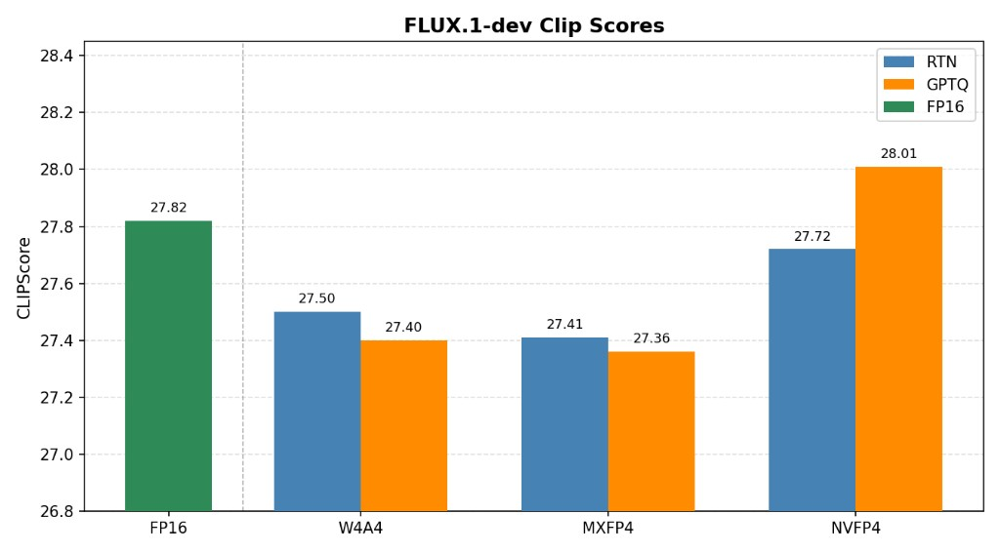

.. Copyright (C) 2026, Advanced Micro Devices, Inc. All rights reserved.

SVD-Based Error Correction (SVDQuant)
=====================================

.. note::

    In this documentation, **AMD Quark** is sometimes referred to simply as
    **"Quark"** for ease of reference.

AMD Quark supports **SVDQuant**, a post-training quantization algorithm
introduced in `SVDQuant: Absorbing Outliers by Low-Rank Components for 4-Bit
Diffusion Models <https://arxiv.org/abs/2411.05007>`__.  It is the primary
algorithm for aggressively quantizing diffusion models (for example, INT4
weights, optionally with INT4 activations) while preserving image quality.

How SVDQuant works
~~~~~~~~~~~~~~~~~~~

Quantizing weights and activations to very low bit-widths (such as INT4) is
hard because outliers in either tensor stretch the quantization range and waste
most of the available bins.  SVDQuant addresses this in two stages:

1. **Smoothing.**  A migration of quantization difficulty between activations
   and weights, controlled by a strength ``alpha`` (the same idea as
   SmoothQuant).  This redistributes outliers so that neither tensor dominates
   the error.

2. **Low-rank error correction.**  The residual between the original weight and
   its quantized version still carries the hardest-to-represent components.
   SVDQuant decomposes that residual with an SVD and keeps a small
   **low-rank correction branch** in high precision (rank ``svd_rank``).  At
   inference the layer output is the quantized main path plus this low-rank
   correction, so the bulk of the compute stays low-bit while the most
   error-sensitive directions are corrected in high precision.

In Quark the algorithm is implemented by ``SVDQuantProcessor`` (in
``quark.torch.algorithm.svdquant``).  At a high level it:

- collects activation statistics on calibration data;
- computes per-layer smoothing factors (searching ``alpha`` per layer when
  ``search_alpha`` is enabled, otherwise using a fixed ``smooth_alpha``);
- performs the SVD decomposition and wraps each target layer in an
  ``ErrorCorrectedModule`` (main quantized path + ``LowRankCorrectionModule``);
- optionally quantizes the residual weights with GPTQ (Hessian-based,
  column-wise) instead of round-to-nearest when ``use_gptq`` is set.

Algorithm choices
~~~~~~~~~~~~~~~~~

SVDQuant exposes two important choices that trade compute for quality.

**Residual quantization: RTN vs GPTQ.**  After the low-rank correction branch is
factored out, the remaining residual weights are quantized.  By default this
uses round-to-nearest (RTN).  Setting ``use_gptq=True`` instead quantizes the
residual with GPTQ -- a Hessian-based, column-wise method that compensates for
quantization error using activation statistics.  GPTQ is more expensive (it
collects and inverts Hessian information) but typically improves quality at very
low bit-widths.  The ``gptq_*`` parameters control the GPTQ pass.

**Smoothing strength: fixed alpha vs per-layer search.**  The smoothing strength
``alpha`` balances quantization difficulty between activations and weights.  With
``search_alpha=False`` a single fixed ``smooth_alpha`` is used everywhere.  With
``search_alpha=True`` (the default) Quark searches ``alpha`` independently for
each layer, choosing the value that minimizes the post-SVD layer-output MSE on
calibration data (matching the original paper).  The search is more accurate but
adds calibration compute; ``alpha_candidates`` and ``alpha_search_max_samples``
tune its cost.

Configuring SVDQuant
~~~~~~~~~~~~~~~~~~~~

SVDQuant is configured with ``SVDQuantConfig`` and attached to a ``QConfig``
through its ``algo_config`` list.  The weight/activation data types come from
the ``QConfig`` itself (for example via ``build_quant_layer_config``); the
``SVDQuantConfig`` controls the algorithm.

.. list-table:: ``SVDQuantConfig`` parameters
   :header-rows: 1
   :widths: 28 14 58

   * - Parameter
     - Default
     - Description
   * - ``svd_rank``
     - 32
     - Rank of the low-rank correction branch.  Higher rank corrects more
       error (better quality) at the cost of a larger high-precision branch.
   * - ``smooth_alpha``
     - 0.5
     - Fixed smoothing migration strength, used when ``search_alpha`` is False.
   * - ``search_alpha``
     - True
     - Search ``alpha`` per layer to minimize post-SVD layer-output MSE on
       calibration data (matches the paper).  More accurate, requires more compute during calibration.
   * - ``alpha_candidates``
     - None
     - Optional explicit list of ``alpha`` values to search over.
   * - ``alpha_search_max_samples``
     - 8
     - Number of calibration samples used during the per-layer ``alpha`` search.
   * - ``exclude_patterns``
     - (see below)
     - Layer-name globs excluded from SVD decomposition (embeddings, in/out
       projections, etc.).
   * - ``min_layer_size``
     - 256
     - Minimum layer dimension to apply SVDQuant to; smaller layers are skipped.
   * - ``use_gptq``
     - False
     - Quantize residual weights with GPTQ instead of round-to-nearest.
   * - ``gptq_n_bits`` / ``gptq_symmetric`` / ``gptq_group_size`` /
       ``gptq_blocksize`` / ``gptq_percdamp`` / ``gptq_actorder``
     - 4 / True / -1 / 128 / 0.01 / False
     - GPTQ residual-quantization knobs (only used when ``use_gptq`` is True).

Usage
~~~~~

.. code-block:: python

    from quark.torch import ModelQuantizer
    from quark.torch.quantization.config.config import QConfig, SVDQuantConfig
    from quark.torch.algorithm.svdquant import build_quant_layer_config

    qconfig = QConfig(
        global_quant_config=build_quant_layer_config("w4a16"),
        exclude=["*time_embedding*", "*conv_in*", "*conv_out*", "*correction*"],
        algo_config=[SVDQuantConfig(
            svd_rank=32,
            search_alpha=False,
            exclude_patterns=["*time_embedding*", "*conv_in*", "*conv_out*"],
        )],
    )

    model = ModelQuantizer(qconfig).quantize_model(model, dataloader)

``build_quant_layer_config`` provides ready-made schemes: ``w4a16`` (INT4
weight-only), ``w4a4`` (INT4 weight + activation), ``mxfp4`` (OCP Microscaling
FP4 weights + dynamic FP4 activations), and ``nvfp4`` (FP4 block-16 weights +
dynamic FP4 activations).  All four are used the same way -- only the
``global_quant_config`` mode changes.

.. note::

   ``*correction*`` must always be present in the ``QConfig.exclude`` list so
   that the high-precision low-rank correction branch is not itself quantized.

Using SVDQuant with diffusion models
~~~~~~~~~~~~~~~~~~~~~~~~~~~~~~~~~~~~

SVDQuant is most commonly used to quantize diffusion submodules
(``pipe.unet`` or ``pipe.transformer``).  Calibration data is collected from a
pipeline run with ``quark.torch.utils.diffusers.get_calib_dataloader``, and the
model-specific ``exclude``/``exclude_patterns`` differ per architecture (SDXL,
SD3, Flux).  See
:doc:`Quantizing Diffusion Models with Quark <example_quark_torch_diffusers>`
for complete, validated SDXL / SD3 / Flux examples, and
:doc:`xDiT Inference with Quark Quantization <example_quark_torch_xdit>`
for running quantized diffusion models with multi-GPU distributed inference.

Native inference (MXFP4)
~~~~~~~~~~~~~~~~~~~~~~~~~

By default a quantized SVDQuant model runs through the fake-quant / dequantize
(QDQ) emulation path, which reproduces the low-bit results but still computes in
high precision.  On AMD GPUs (ROCm) with `AITER
<https://github.com/ROCm/aiter>`__ installed, an **MXFP4** SVDQuant model can
instead run with real low-bit GEMM kernels via
``quark.torch.enable_native_inference``:

.. code-block:: python

    from quark.torch import enable_native_inference, disable_native_inference
    from quark.torch.quantization.utils import RuntimeOptions

    # model was quantized with build_quant_layer_config("mxfp4") + SVDQuantConfig
    n_converted = enable_native_inference(
        model,
        runtime_options=RuntimeOptions(
            native_linear_mode="mxfp4",
            svdquant_overlap_streams=False,  # True: run the low-rank correction on a side CUDA stream
        ),
    )

    # ... run inference ...

    disable_native_inference(model)  # revert to the export-format layers

``enable_native_inference`` detects SVDQuant ``ErrorCorrectedModule`` wrappers
and replaces each one with a fused layer that runs the **MXFP4 residual GEMM**
on AITER kernels and adds the **high-precision low-rank correction branch**;
bare MXFP4 ``QParamsLinear`` layers are converted to the plain MXFP4 native
linear.  Setting ``svdquant_overlap_streams=True`` runs the low-rank correction
on a second CUDA stream so it overlaps the residual GEMM.

.. note::

   Native inference currently supports an **MXFP4 residual only** for SVDQuant
   (FP4 per-group, ``group_size=32``); SVDQuant layers with a non-MXFP4 residual
   are left on the eager path.  Save the canonical Quark checkpoint *before*
   calling ``enable_native_inference`` -- the kernel-format weights live in
   non-persistent buffers, so export/reload always uses the standard Quark
   format regardless of whether native inference is active.

Benchmark results
~~~~~~~~~~~~~~~~~

The following CLIP scores were measured on **FLUX.1-dev** with AMD Quark,
evaluated on 1000 MJHQ samples using ``openai/clip-vit-large-patch14``.  RTN and
GPTQ refer to how the SVDQuant residual weights are quantized
(round-to-nearest versus GPTQ).

.. list-table:: FLUX.1-dev CLIP score (higher is better)
   :header-rows: 1
   :widths: 40 30

   * - Configuration
     - CLIP score
   * - FP16 (reference)
     - 27.82
   * - RTN W4A4
     - 27.50
   * - RTN MXFP4
     - 27.41
   * - RTN NVFP4
     - 27.72
   * - GPTQ W4A4
     - 27.40
   * - GPTQ MXFP4
     - 27.36
   * - GPTQ NVFP4
     - 28.01

   FLUX.1-dev CLIP scores for SVDQuant in W4A4, MXFP4, and NVFP4, comparing
   round-to-nearest (RTN) and GPTQ residual quantization against the FP16
   reference.

Across these low-bit configurations the CLIP score stays close to the FP16
reference, and NVFP4 in particular is competitive with full precision.

Related topics
~~~~~~~~~~~~~~

* :doc:`Quantization Strategies <quantization_strategies>` -- weight-only,
  static, and dynamic activation quantization.
* :doc:`Activation/Weight Smoothing (SmoothQuant) <smoothquant>` -- the
  smoothing idea SVDQuant builds on.
* :doc:`Quantizing Diffusion Models with Quark <example_quark_torch_diffusers>`
  -- end-to-end diffusion examples.
