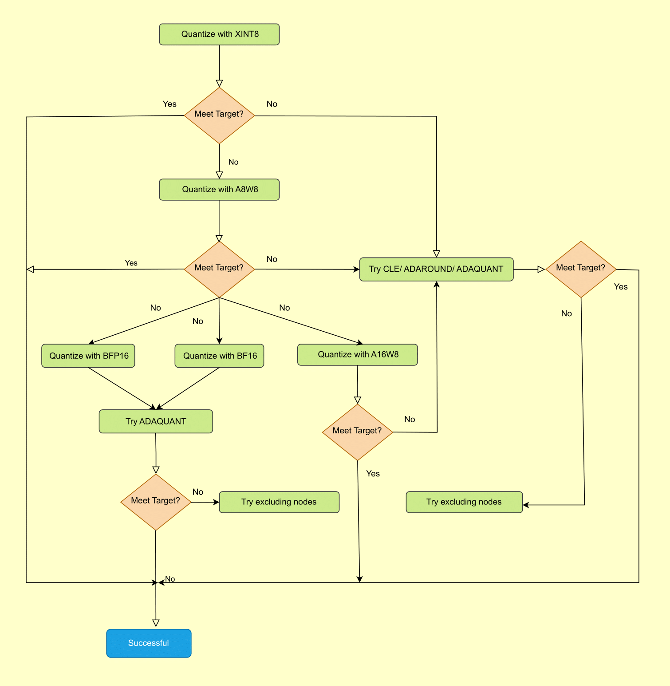

.. Copyright (C) 2024, Advanced Micro Devices, Inc. All rights reserved.

Best Practice for Ryzen AI in AMD Quark ONNX
============================================

This topic outlines the best practice for Post-Training Quantization (PTQ) in AMD Quark ONNX. It provides guidance on fine-tuning your quantization strategy to meet target quantization accuracy.

   **Figure 1. Best Practices for Quark ONNX Quantization**

The flowchart above outlines the recommended step-by-step strategy for achieving your
target accuracy. Follow these steps in order, moving to the next only when the current
configuration does not meet your accuracy requirement.

Step 1 — Start with XINT8
--------------------------

Begin with XINT8, which uses symmetric INT8 quantization with power-of-two scales for
both activations and weights. XINT8 is the native format for the Ryzen AI NPU and
delivers the best inference performance. Many models meet their accuracy target at this
step with no further tuning required.

Step 2 — Apply accuracy improvement algorithms (CLE, ADAROUND, ADAQUANT)
--------------------------------------------------------------------------

If XINT8 alone does not meet your target, apply accuracy-improvement algorithms before
switching to a higher-precision format. Try them in the following order:

- **CLE (Cross Layer Equalization):** Try this first. CLE rescales weights across
  adjacent layers to reduce quantization error. It adds no calibration overhead and is
  the lowest-cost option to improve accuracy.
- **ADAROUND (Adaptive Rounding):** If CLE is insufficient, ADAROUND optimizes the
  rounding direction of each weight to minimize output reconstruction error. It requires
  a small calibration set and a short optimization pass.
- **ADAQUANT (Adaptive Quantization):** The most powerful of the three. ADAQUANT
  minimizes layer-wise reconstruction error by jointly tuning quantization parameters.
  It is more compute-intensive than ADAROUND but can recover accuracy in difficult cases.

Step 3 — Switch to a higher-precision format (A8W8, A16W8, BFP16, BF16)
-------------------------------------------------------------------------

If accuracy-improvement algorithms do not close the gap, consider switching to a format
with greater numerical range or precision:

- **A8W8:** Uses float scales instead of power-of-two scales. This relaxes the scale
  constraint and often recovers accuracy lost in XINT8 without changing the INT8
  bit-width.
- **A16W8:** Uses INT16 activations with INT8 weights. The wider activation range makes
  this a good choice when activation distributions are difficult to represent at INT8
  precision.
- **BF16 / BFP16:** Floating-point formats that preserve a wide dynamic range. Use these
  when INT8-based formats consistently fall short, or when the model contains layers with
  extreme outlier values.

After switching format, re-apply CLE, ADAROUND, or ADAQUANT if the new format still does
not meet the target.

Step 4 — Exclude sensitive nodes
---------------------------------

As a final tuning step, identify layers that contribute disproportionately to accuracy
loss and exclude them from quantization, leaving them in their original floating-point
precision. This is most useful when a small number of layers are outliers that are
difficult to quantize regardless of format. Because excluding nodes increases model size
and may reduce NPU utilization, apply this selectively.

**See also:** :doc:`Ryzen AI-Specific Tutorials <../../tutorial_onnx_ryzenai_specific_toc>`
