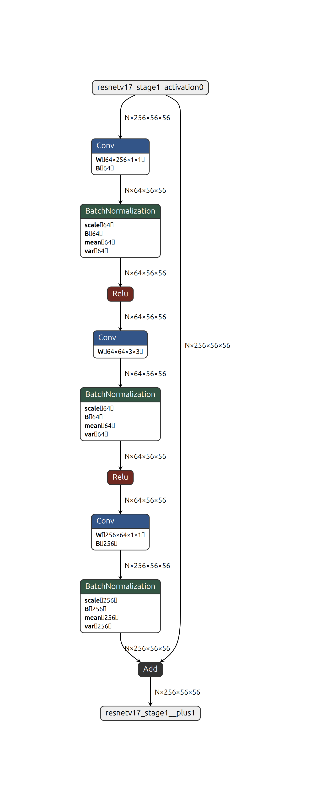
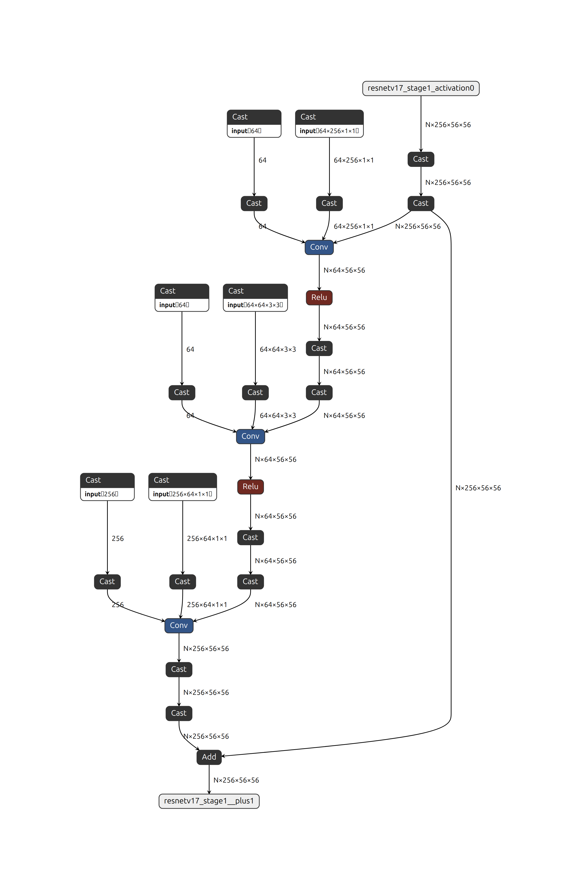

.. Copyright (C) 2025, Advanced Micro Devices, Inc. All rights reserved.

FP32/FP16 to BF16 Model Conversion
==================================

.. note::

    In this documentation, **AMD Quark** is sometimes referred to simply as **"Quark"** for ease of reference. When you  encounter the term "Quark" without the "AMD" prefix, it specifically refers to the AMD Quark quantizer unless otherwise stated. Please do not confuse it with other products or technologies that share the name "Quark".

Introduction
------------

BFloat16 (Brain Floating Point 16) is a floating-point format designed for deep learning, offering reduced memory usage and faster computation while maintaining sufficient numerical precision.

AMD's latest NPU and GPU devices natively support BF16, enabling more efficient matrix operations and lower latency. This guide explains how to convert an FP32/FP16 model to BF16 using Quark.

How to Convert FP32 to BF16
---------------------------

Run the following command to convert an FP32 ONNX model to BF16:

.. code-block:: bash

    python -m quark.onnx.tools.convert_fp32_to_bf16 --input $FLOAT32_ONNX_MODEL_PATH --output $BFLOAT16_ONNX_MODEL_PATH --format with_cast

How to Convert FP16 to BF16
---------------------------

Run the following command to convert an FP16 ONNX model to BF16:

.. code-block:: bash

    python -m quark.onnx.tools.convert_fp16_to_bf16 --input $FLOAT16_ONNX_MODEL_PATH --output $BFLOAT16_ONNX_MODEL_PATH --format with_cast

How the Graph Changes
---------------------

The ``with_cast`` format represents BF16 rounding by inserting a Cast to BF16 followed by a Cast back to FP32 at selected tensor boundaries. The first Cast applies BF16 rounding; the second Cast restores FP32 storage so the next operator can consume the BF16-rounded values. For FP16 input models, Quark also preserves FP16 at the model inputs and outputs.

During conversion, Quark also applies graph optimizations. Figures 1 and 2 are Netron views of the same residual block extracted from the `ONNX Model Zoo ResNet50 v1-12 model <https://huggingface.co/onnxmodelzoo/resnet50-v1-12>`_ before and after FP32-to-BF16 conversion. The extracted model keeps the residual shortcut and the initializer branches required by its Conv nodes, so the figures show the actual ONNX graphs rather than a schematic.

   **Figure 1. Netron View of the FP32 ResNet50 Residual Block**

   **Figure 2. Netron View of the Same Residual Block After BF16 Conversion**

Compared with Figure 1, Figure 2 shows the following changes:

- Cast pairs apply BF16 rounding on selected activation and initializer paths.
- The BatchNormalization nodes visible in Figure 1 are folded into the corresponding Conv nodes during graph optimization.
- The residual shortcut and Add operation remain in place.

How to Measure Accuracy (Compare Differences between FP32/FP16 and BF16)
------------------------------------------------------------------------

- **infer float/float16 and bfloat16 models and save results**

You can refer to the following code to infer the float32/float16 and bfloat16 models and save the results.

.. code-block:: python

    import numpy as np
    import os
    import onnxruntime as ort

    def infer_model_and_save_output(onnx_model_path, input_data_loader, output_dir):
        ort_session = ort.InferenceSession(onnx_model_path)
        # Assume the model has only one input.
        input_name = ort_session.get_inputs()[0].name
        for index, input_data in enumerate(input_data_loader):
            ort_inputs = {input_name: input_data}
            ort_outs = ort_session.run(None, ort_inputs)
            output_numpy = ort_outs[0]
            os.makedirs(output_dir, exist_ok=True)
            output_file = os.path.join(output_dir, str(index) + ".npy")
            np.save(output_file, output_numpy)
        print(f"Results saved to {output_dir}.")

    onnx_model_path = "float32_model.onnx" # Replace with "float16_model.onnx" or "bfloat16_model.onnx"
    # input_data_loader is an iterable object that returns a numpy tensor each time. It is user-defined.
    output_dir = "baseline_results" # Replace with "quantized_results"
    infer_model_and_save_output(onnx_model_path, input_data_loader, output_dir)

- **calculate differences**

If you need to compare the differences between float32/float16 and bfloat16 models after conversion. We support some metrics (cosine similarity, L2 loss, PSNR) for comparing differences between float32/float16 and bfloat16 inference results. The formats (JPG, PNG and NPY) of inference result in folders are supported. you can use this command to compare:

.. code-block:: bash

    python -m quark.onnx.tools.evaluate --baseline_results_folder $BASELINE_RESULTS_FOLDER_PATH --quantized_results_folder $QUANTIZED_RESULTS_FOLDER_PATH

How to Improve BF16 Accuracy
----------------------------

If the accuracy of bfloat16 model can not meet your target, you can improve bfloat16 accuracy with adaquant finetuning. Here is a simple example of how to improve BF16 accuracy. **NumIterations** and **LearningRate** are two important parameters for improving accuracy during the finetuning process. Their explanations are as follows. For more detailed information, see :doc:`BF16 Quantization <../../onnx/tutorial_bf16_quantization>`.

  - **NumIterations**: (Int) The number of iterations for finetuning. More iterations can lead to better accuracy but also longer training time. The default value is 1000.

  - **LearningRate**: (Float) Learning rate for finetuning. It significantly impacts the improvement of fast finetune, and experimenting with different learning rates might yield better results for your model. The default value is 1e-6.

.. code:: python

   from quark.onnx import ModelQuantizer, ExtendedQuantType, ExtendedQuantFormat, QLayerConfig, BFloat16Spec, CalibMethod, CLEConfig, AdaQuantConfig

   input_tensors_spec = BFloat16Spec(calibration_method=CalibMethod.MinMax)
   weight_spec = BFloat16Spec(calibration_method=CalibMethod.MinMax)
   algo_conf = [CLEConfig(), AdaQuantConfig(num_iterations=1000, learning_rate=1e-6)]
   extra_info = {
       'BF16QDQToCast': True,
       'QuantizeAllOpTypes': True,
       'ForceQuantizeNoInputCheck': True,
   }

   config = QConfig(QLayerConfig(activation=activation_spec, weight=weight_spec), algo_config=algo_conf, extra_options=extra_info)

   quantizer = ModelQuantizer(config)
   quantizer.quantize_model(input_model_path, output_model_path, data_reader)
