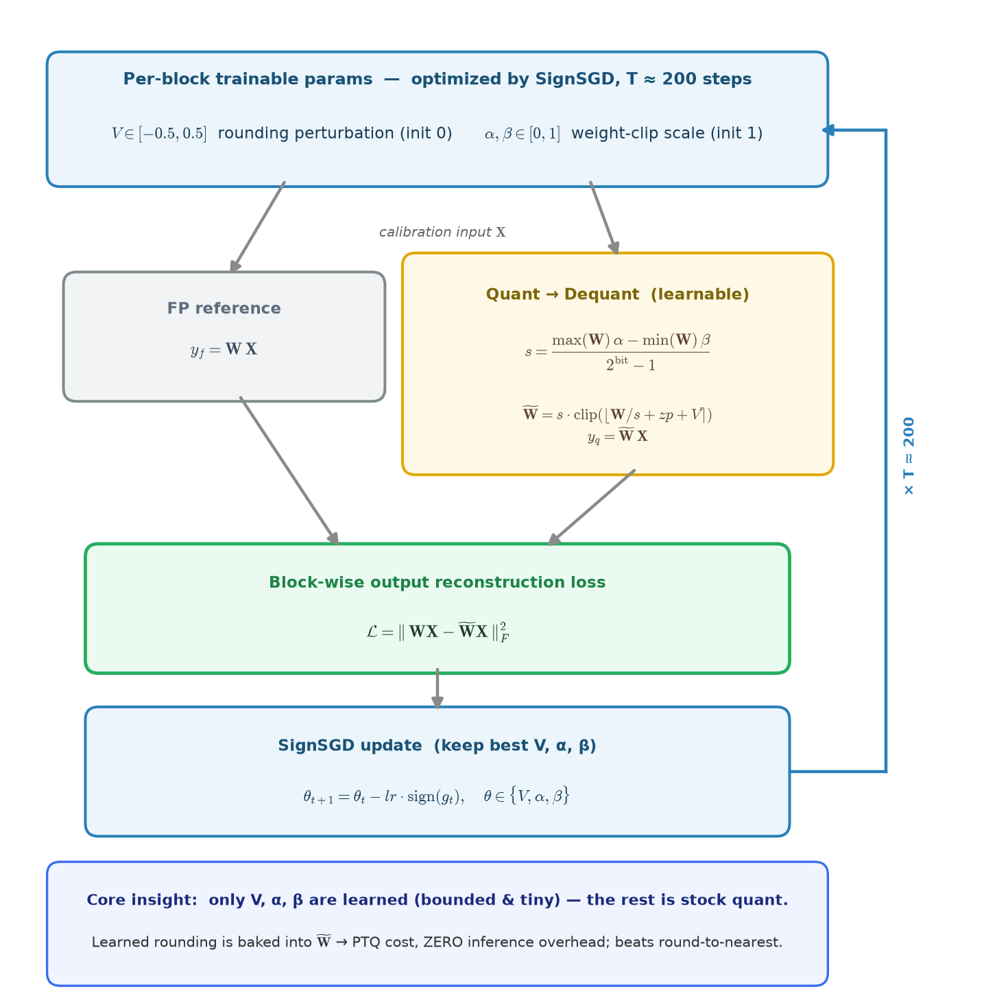

# AutoRound

## Algorithm Overview

<p align="center">
  
</p>

AutoRound (SignRound, [arXiv:2309.05516](https://arxiv.org/abs/2309.05516))
replaces round-to-nearest (RTN) with **learned** weight rounding. For each
transformer block it introduces three tiny, bounded trainable parameters and
tunes them to minimize that block's output reconstruction error:

- **Parameters** — a rounding perturbation `V ∈ [-0.5, 0.5]` (init 0) and two
  weight-clipping scales `α, β ∈ [0, 1]` (init 1).
- **Objective** — block-wise output MSE $\lVert WX - \tilde{W}X \rVert_F^2$.
- **Optimizer** — signed gradient descent (SignSGD, using only `sign(g)`); the
  bounded search space lets it converge in ~200 steps.
- **Inference** — the learned `V/α/β` fold into the quantized weights, so there
  is zero runtime overhead: PTQ cost with QAT-like accuracy.

## Quick Start

```bash
# INT4 (W4G128)
python examples/torch/experimental/autoround/main.py \
    --model Qwen/Qwen3.5-4B --model_trust_remote_code --quant_scheme uint4_wo_asym \
    --tasks mmlu --num_fewshot 0

# MXFP4 (weight-only)
python examples/torch/experimental/autoround/main.py \
    --model Meta/Llama-3.1-8B-Instruct --model_trust_remote_code --quant_scheme mxfp4_weight_only \
    --tasks mmlu --num_fewshot 0
```

## Evaluation Results

We validate AutoRound on INT4 (W4G128) and MXFP4 weight-only using Qwen3.5-4B and Llama-3.1-8B-Instruct. We evaluate using WikiText2 PPL and MMLU accuracy.

| Model | Quant Scheme | Method | PPL | MMLU |
|---|---|---|---|---|
| Qwen3.5-4B | INT4 (W4G128) | BF16 | 9.588 | 74.31 |
| Qwen3.5-4B | INT4 (W4G128) | RTN | 9.982 | 72.58 |
| Qwen3.5-4B | INT4 (W4G128) | AutoRound | 9.809 | 73.07 |
| Llama-3.1-8B-Instruct | MXFP4 (weight-only) | BF16 | 7.215 | 68.32 |
| Llama-3.1-8B-Instruct | MXFP4 (weight-only) | RTN | 7.841 | 64.74 |
| Llama-3.1-8B-Instruct | MXFP4 (weight-only) | AutoRound | 7.652 | 66.44 |

The results in the table show that AutoRound outperforms RTN on both INT4 (W4G128) and MXFP4 weight-only quantization.
